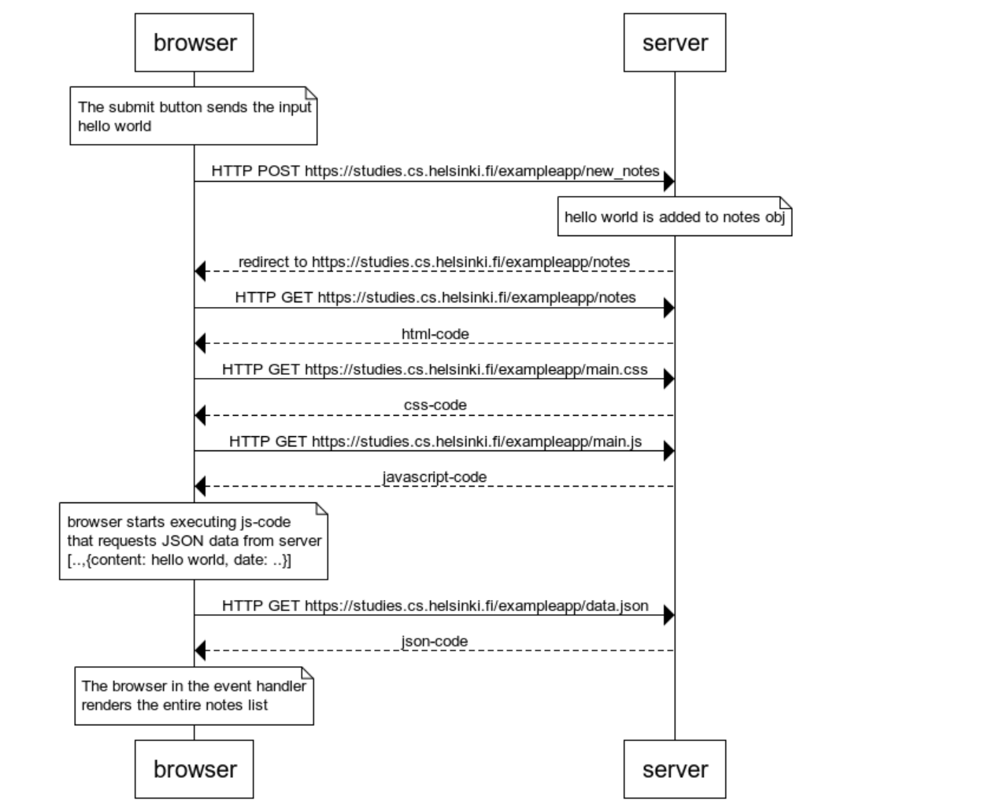

```
note over browser
The submit button sends the input
hello world 
end note

browser->server: HTTP POST https://studies.cs.helsinki.fi/exampleapp/new_notes

note over server
hello world is added to notes obj
end note

server-->browser: redirect to https://studies.cs.helsinki.fi/exampleapp/notes
browser->server: HTTP GET https://studies.cs.helsinki.fi/exampleapp/notes
server-->browser: html-code
browser->server:  HTTP GET https://studies.cs.helsinki.fi/exampleapp/main.css
server-->browser: css-code
browser->server:  HTTP GET https://studies.cs.helsinki.fi/exampleapp/main.js
server-->browser: javascript-code

note over browser
  browser starts executing js-code
  that requests JSON data from server
  [..,{content: hello world, date: ..}]
end note

browser->server:  HTTP GET https://studies.cs.helsinki.fi/exampleapp/data.json
server-->browser: json-code
note over browser
 The browser in the event handler 
 renders the entire notes list
end note
```

