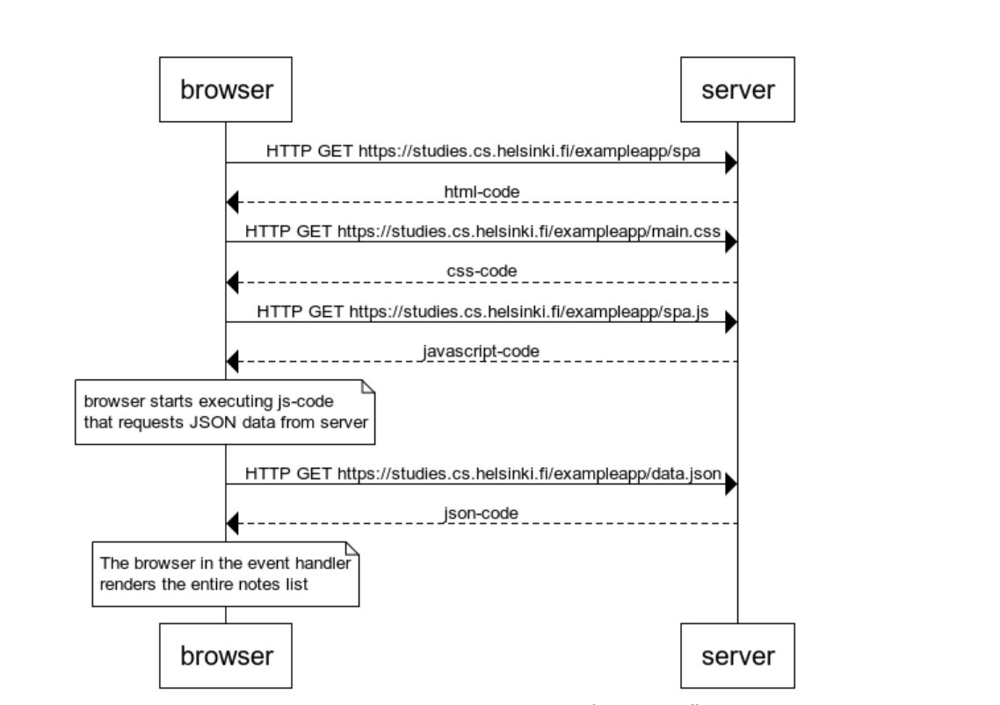

```
browser->server: HTTP GET https://studies.cs.helsinki.fi/exampleapp/spa
server-->browser: html-code

browser->server:  HTTP GET https://studies.cs.helsinki.fi/exampleapp/main.css
server-->browser: css-code

browser->server:  HTTP GET https://studies.cs.helsinki.fi/exampleapp/spa.js
server-->browser: javascript-code

note over browser
  browser starts executing js-code
  that requests JSON data from server
end note

browser->server:  HTTP GET https://studies.cs.helsinki.fi/exampleapp/data.json
server-->browser: json-code

note over browser
 The browser in the event handler 
 renders the entire notes list
end note
```

