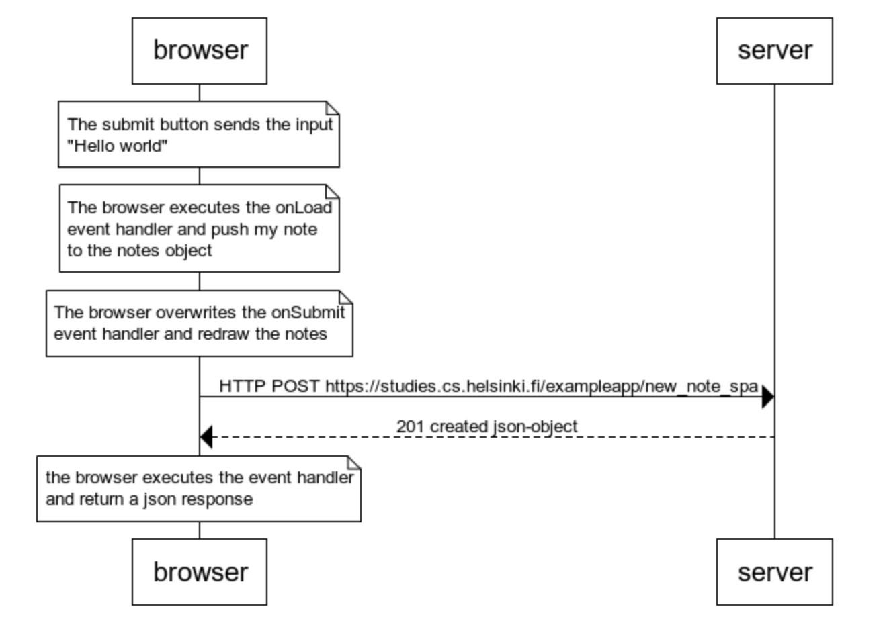

```
note over browser
The submit button sends the input
"Hello world" 
end note

note over browser
The browser executes the onLoad 
event handler and push my note
to the notes object
end note

note over browser
The browser overwrites the onSubmit 
event handler and redraw the notes 
end note

browser->server: HTTP POST https://studies.cs.helsinki.fi/exampleapp/new_note_spa
server-->browser: 201 created json-object

note over browser
the browser executes the event handler
and return a json response
end note
```

